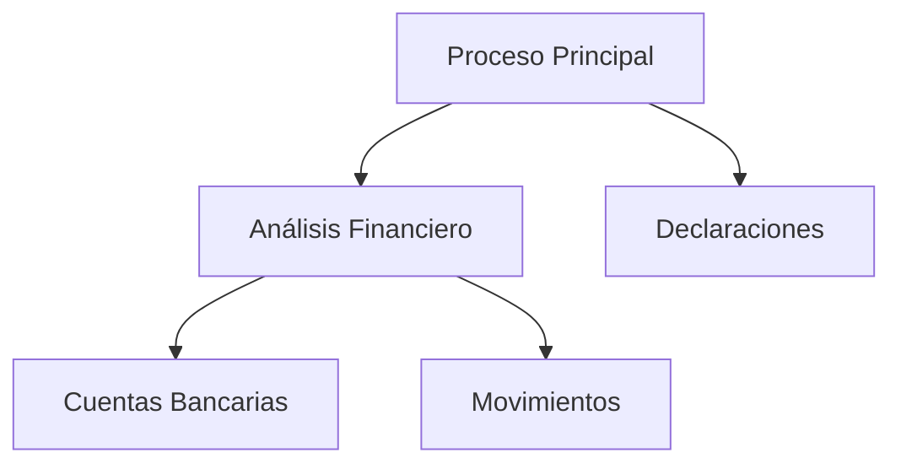
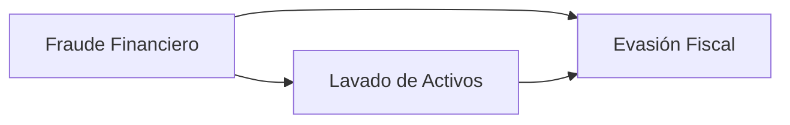
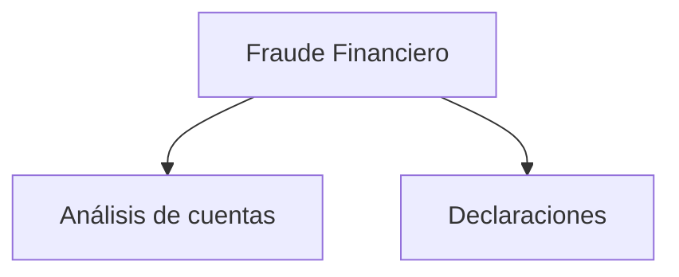
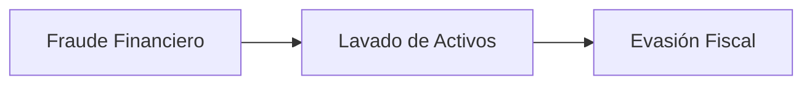

# Graph & Tree

Implementación propia de las estructuras de datos **Graph** y **Tree** en Java utilizando genéricos.

El proyecto demuestra cómo utilizar estas estructuras para administrar:

* Procesos
* Expedientes
* Relaciones entre casos

sin depender de implementaciones específicas de la biblioteca estándar.

---

# ¿Por qué dos estructuras?

En sistemas de gestión documental, jurídicos o administrativos normalmente existen dos tipos de relaciones:

### Relación Jerárquica

Un expediente puede contener múltiples subexpedientes.

Ejemplo:

```text
Proceso Principal
├── Investigación Financiera
├── Declaraciones
└── Evidencias
```

Esta estructura se representa mediante un **Tree**.

---

### Relación entre Casos

Un expediente puede estar relacionado con otros expedientes sin importar su posición en la jerarquía.

Ejemplo:

```text
Fraude Financiero
        ↕
Lavado de Activos
        ↕
Evasión Fiscal
```

Esta estructura se representa mediante un **Graph**.

---

# Modelo de Dominio

```java
public record Expediente(
        long id,
        String numero,
        String titulo,
        Estado estado
) {

    public enum Estado {
        ABIERTO,
        EN_PROCESO,
        CERRADO
    }

}
```

---

# Tree

El árbol representa la estructura jerárquica de procesos y expedientes.

## Ejemplo visual



---

## Interfaz

```java
public interface Tree<K, V> {

    void setRoot(K key, V value);

    void addChild(K parentKey, K childKey, V value);

    void remove(K key);

    boolean contains(K key);

    V getValue(K key);

    Collection<K> getChildren(K key);

    K getParent(K key);

    int size();

    void clear();
}
```

---

# Graph

El grafo representa relaciones entre expedientes.

## Ejemplo visual



---

## Interfaz

```java
public interface Graph<K, V> {

    void addVertex(K key, V value);

    void removeVertex(K key);

    void addEdge(K from, K to);

    void removeEdge(K from, K to);

    boolean containsVertex(K key);

    boolean containsEdge(K from, K to);

    V getValue(K key);

    Collection<K> getNeighbors(K key);

    int size();

    void clear();
}
```

---

## Uso

```java
Graph<Long, Expediente> graph = new GraphImpl<>();

graph.addVertex(
        1L,
        expediente1
);

graph.addVertex(
        2L,
        expediente2
);

graph.addEdge(1L, 2L);
```

---

# Ejemplo Completo

El siguiente ejemplo utiliza ambas estructuras simultáneamente.



Relaciones adicionales:



---

# Operaciones Principales

## Tree

| Operación   | Descripción       |
| ----------- | ----------------- |
| setRoot     | Define la raíz    |
| addChild    | Agrega un hijo    |
| getParent   | Obtiene el padre  |
| getChildren | Obtiene los hijos |
| remove      | Elimina un nodo   |

---

## Graph

| Operación    | Descripción          |
| ------------ | -------------------- |
| addVertex    | Agrega un vértice    |
| addEdge      | Conecta vértices     |
| getNeighbors | Obtiene vecinos      |
| removeEdge   | Elimina una relación |
| removeVertex | Elimina un vértice   |

---

# Complejidad

## Tree

| Operación   | Complejidad |
| ----------- | ----------- |
| setRoot     | O(1)        |
| addChild    | O(1)        |
| contains    | O(1)        |
| getParent   | O(1)        |
| getChildren | O(1)        |
| remove      | O(n)        |

---

## Graph

| Operación      | Complejidad |
| -------------- | ----------- |
| addVertex      | O(1)        |
| containsVertex | O(1)        |
| addEdge        | O(1)        |
| removeEdge     | O(1)        |
| getNeighbors   | O(1)        |
| removeVertex   | O(V + E)    |

---

# Casos de Uso

* Gestión documental.
* Sistemas jurídicos.
* Gestión de expedientes.
* Sistemas de tickets.
* Dependencias entre módulos.
* Redes sociales.
* Motores de rutas.
* Grafos financieros y arbitraje.

---

# Objetivo

El objetivo principal del proyecto es mostrar cómo implementar estructuras de datos fundamentales desde cero en Java y cómo utilizarlas para modelar problemas reales mediante relaciones jerárquicas (Tree) y relaciones arbitrarias (Graph).
